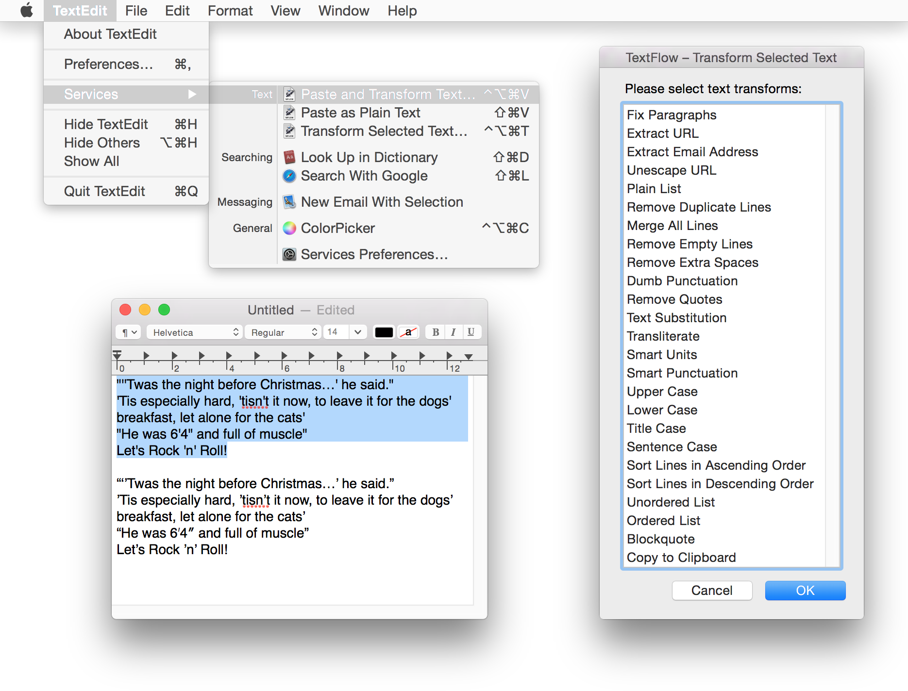
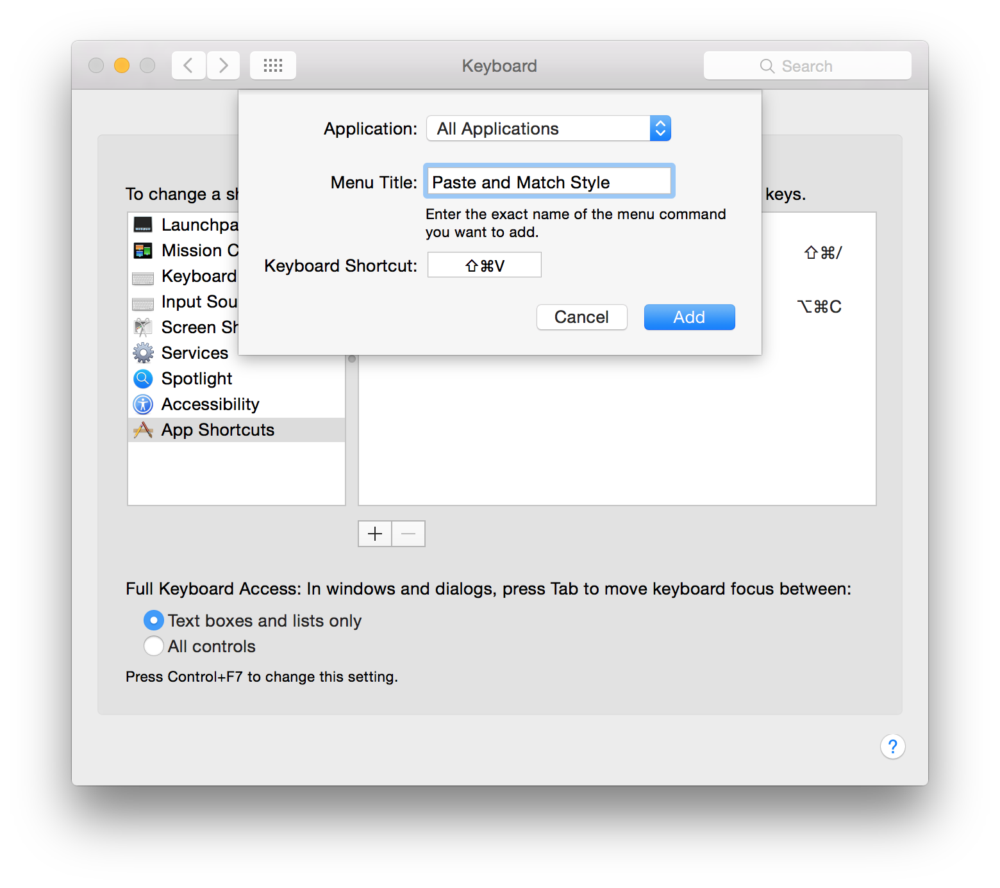

# TextFlow

TextFlow is a set of Automator workflows for text manipulation featuring basic technical editing including smart punctuation, text substitution and the easiest way to paste unformatted text in every OS X application.

## Workflows

- Paste and Transform Text
- Transform Selected Text
- Paste as Plain Text

## Text transforms

By default, TextFlow removes any formatting from the text.

- Fix Paragraphs
- Extract URL
- Extract Email Address
- Unescape URL
- Plain List
- Remove Duplicate Lines
- Merge All Lines
- Remove Empty Lines
- Remove Extra Spaces
- Replace Spaces with Underscores
- Replace Spaces with Hyphens
- Dumb Punctuation
- Remove Quotes
- Text Substitution\*
- Transliterate
- Smart Units
- Smart Punctuation
- Upper Case
- Lower Case
- Title Case
- AP Style Title Case
- Sentence Case
- Quote
- Sort Lines in Ascending Order
- Sort Lines in Descending Order
- Unordered List
- Ordered List
- Blockquote
- Copy to Clipboard\*\*

\* Or Text Expansion, specify your substitutions in * > System Preferences > Keyboard > Text*.  
\*\* Some WYSIWYG editors, or content editable fields, in browsers ignore TextFlow output and paste directly from Clipboard. Include this option to fix the issue. In worst-case scenario, you can *Copy*, then *Paste and Transform Text* with *Copy to Clipboard* selected, and finally *Paste*.

## Install

1. Download [the latest release](https://github.com/vmdanilov/TextFlow/archive/master.zip).
2. Unpack the archive.
3. Double click workflows to install for a current user (installed at *~/Library/Services*).\*

\* If Gatekeeper does not allow installation, right-click (or <kbd>⌃ Control</kbd> + click) on a workflow and choose *Open*.

## Usage

1. Run TextFlow workflows from Services menu of current application.
2. Select transforms from the next list.
3. Click *OK* or press <kbd>↵ Enter</kbd> to apply, click *Cancel* or press <kbd>⎋ Esc</kbd> to cancel.

You can assign global shortcuts via * > System Preferences > Keyboard > Shortcuts > Services > Text*.

Recommended shortcuts:

- *Paste and Transform Text*: <kbd>⌃ Control</kbd> <kbd>⌥ Option</kbd> <kbd>⌘ Command</kbd> <kbd>V</kbd>
- *Transform Selected Text*: <kbd>⌃ Control</kbd> <kbd>⌥ Option</kbd> <kbd>⌘ Command</kbd> <kbd>T</kbd>
- *Paste as Plain Text*\*: <kbd>⇧ Shift</kbd> <kbd>⌘ Command</kbd> <kbd>V</kbd>

\* It is also recommended to assign the same global shortcut to *Paste and Match Style* command (and *Paste and Match Formatting*, if using Microsoft Office) via * > System Preferences > Keyboard > Shortcuts > App Shortcuts > All Applications*. This will effectively allow you to have the same shortcut for *Paste and Match Style*, or *Paste as Plain Text*, in every application. The command name may vary in some apps, add those to the list as well, e.g. *Paste and Match Formatting* for Microsoft Office and *Paste as Plain Text* for Evernote.

While it is tempting to just assign <kbd>⌘ Command</kbd> <kbd>V</kbd> to *Paste and Match Style*, this will break pasting to plain textfields and object manipulation for apps like Mail, Messages and Keynote.

## Contributing

Please report bugs, share your ideas or code on Github [TextFlow](https://github.com/vmdanilov/TextFlow) or Twitter [@vmdanilov](https://twitter.com/vmdanilov).

If you like the project, you may [donate some money](https://www.paypal.com/cgi-bin/webscr?cmd=_s-xclick&hosted_button_id=9P6XZDBV7UJKE) via PayPal.

## License

Copyright (c) 2015 Vlad Danilov. Released under [the MIT license](LICENSE.md).
