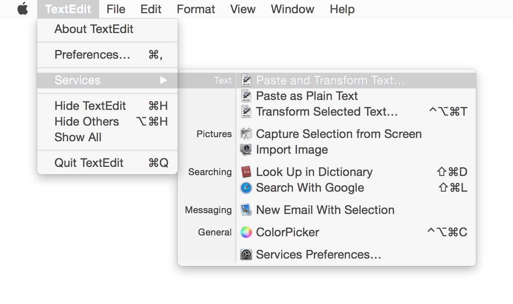
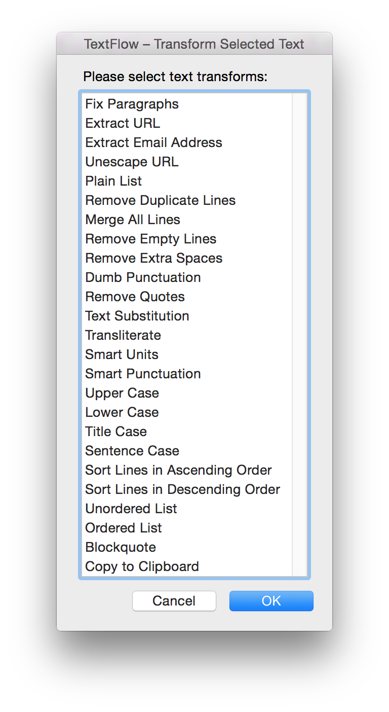

# TextFlow

TextFlow is a set of Automator workflows for text manipulation in any OS X text control where built-in OS X text tools might be unavailable or insufficient.

## Workflows

- Paste Transformed Text
- Transform Selected Text
- Paste Unformatted Text

## Text transforms

- Fix Paragraphs
- Extract URL
- Extract Email Address
- Unescape URL
- Plain List
- Remove Duplicate Lines
- Merge All Lines
- Remove Empty Lines
- Remove Extra Spaces
- Dumb Punctuation
- Remove Quotes
- Text Substitution
- Transliterate
- Smart Units
- Smart Punctuation
- Sentence Case
- Upper Case
- Lower Case
- Title Case
- Sort Lines in Ascending Order
- Sort Lines in Descending Order
- Unordered List
- Ordered List

Note: by default, TextFlow removes any formatting from the text.

## Install

1. Download [the latest release](archive/master.zip).
2. Unpack the archive.
3. Double click workflows to install for a current user. If Gatekeeper does not allow the installation, right-click (or `⌘ Command` + Click) on a workflow and choose Open.

## Usage

1. Run TextFlow workflows from Services menu of current application.
2. Select transforms from the next list.
3. Click *OK* or press `⎋ Esc` to apply, click *Cancel* or press `↵ Enter` to cancel.

You can assign global shortcuts via * > System Preferences > Keyboard > Shortcuts > Services > Text*.

Recommended shortcuts:

- *Paste Transformed Text*: `⌃⌥⌘V`
- *Transform Selected Text*: `⌃⌥⌘T`
- *Paste Unformatted Text*\*: `⇧⌘V`

\* – For the sake of consistency, it is also recommended to assign the same global shortcut to *Paste and Match Style Command* via * > System Preferences > Keyboard > Shortcuts > App Shortcuts > All Applications*.

## Contributing

Please report bugs, share your ideas or code on Github [TextFlow](/) or Twitter [@vmdanilov](https://twitter.com/vmdanilov).

If you like the project, you may [donate some money](https://www.paypal.com/cgi-bin/webscr?cmd=_s-xclick&hosted_button_id=9P6XZDBV7UJKE) via PayPal.

## License

Copyright (c) 2015 Vlad Danilov. Released under [the MIT license](LICENSE.md).